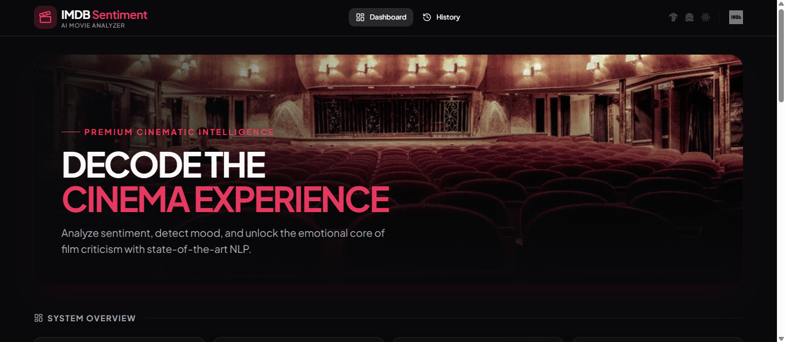
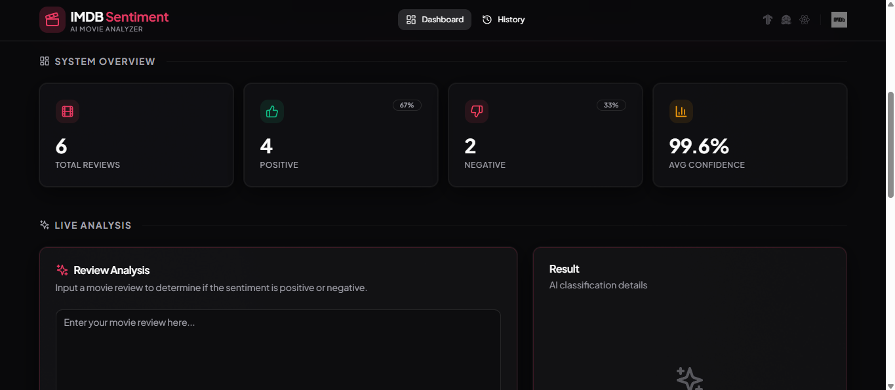
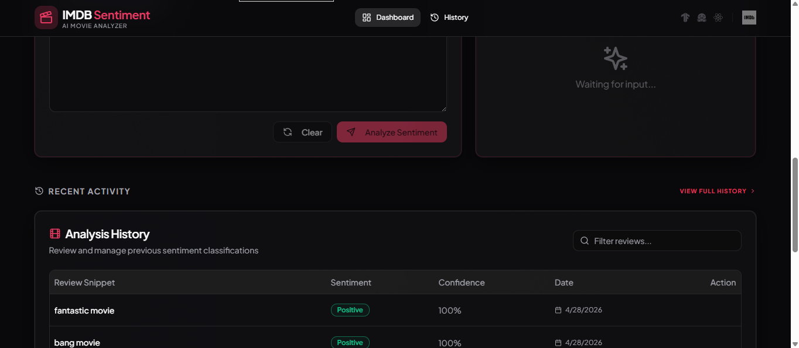
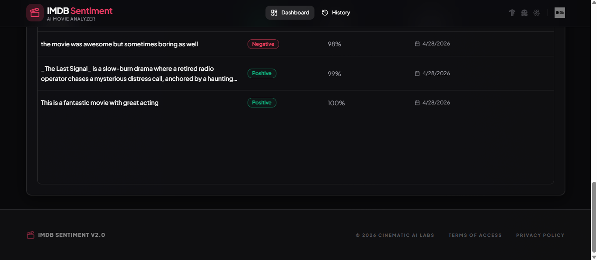

# Text_Classification_Machine_learning_mode
# 🎬 IMDb Sentiment Analysis - Text Classification ML Model

[](https://imdbsentiment.nexttoken.app/)

## 🌐 Live Demo
🔗   https://imdbsentiment.nexttoken.app/

👉 Upload an image and instantly detect landmarks using a trained machine learning model.

---

## 📷 Demo






---

## 📌 Overview

This project focuses on **classifying IMDb movie reviews** as **Positive 😊 or Negative 😞** using Machine Learning techniques.  
The model is trained on labeled review data and predicts sentiment based on textual patterns.

---

## 🎯 Objective
- Build a machine learning model for sentiment analysis  
- Classify movie reviews into positive or negative categories  
- Understand Natural Language Processing (NLP) fundamentals  

---


---

## 🚀 Features
- 📄 Classifies text into positive/negative sentiment  
- 🧠 NLP-based feature extraction  
- ⚡ Fast and efficient predictions  
- 🔍 Handles real-world movie review data  
- 🌐 Can be deployed as a web app  

---

## 🛠️ Tech Stack
- **Programming:** Python  
- **Libraries:** Pandas, NumPy, Matplotlib  
- **NLP Tools:** Scikit-learn / NLTK / TensorFlow  
- **Model:** Logistic Regression / Naive Bayes / Deep Learning  

---

## ⚙️ How It Works

### 1. Data Collection
- Dataset: IMDb movie reviews dataset  
- Contains labeled reviews (positive/negative)  

### 2. Data Preprocessing
- Text cleaning (removing punctuation, stopwords)  
- Tokenization  
- Vectorization (TF-IDF / Count Vectorizer)  

### 3. Model Training
- Trained classification model on processed text data  
- Learned patterns from word frequencies and context  

### 4. Prediction
- Input: User review  
- Output: Sentiment (Positive / Negative) with confidence score  

---

## 📊 Model Performance
- ✅ Accuracy: ~85–90%  
- 📁 Dataset: IMDb Reviews Dataset (Kaggle)  
- 📈 Good performance on unseen reviews  

---

## 📂 Project Structure

imdb-sentiment-analysis/
│── dataset/
│── model/
│── notebooks/
│── app.py / main.py
│── requirements.txt
│── README.md


## ▶️ How to Run

```bash
git clone https://github.com/HarshGautam0/imdb-sentiment-analysis.git
cd imdb-sentiment-analysis
pip install -r requirements.txt
python main.py
```

🌍 Deployment

This project is deployed as a live web application:

🔗 https://imdbsentiment.nexttoken.app/


🔮 Future Improvements

🔹 Use Deep Learning models (LSTM, BERT)
🔹 Improve accuracy with larger dataset
🔹 Add multilingual sentiment analysis
🔹 Deploy as a full-stack web app

🙌 Acknowledgment

This project was developed to gain hands-on experience in NLP and text classification using real-world datasets.


📫 Contact

Harsh Gautam
📧 hg699810@gmail.com

🔗 https://github.com/HarshGautam0

